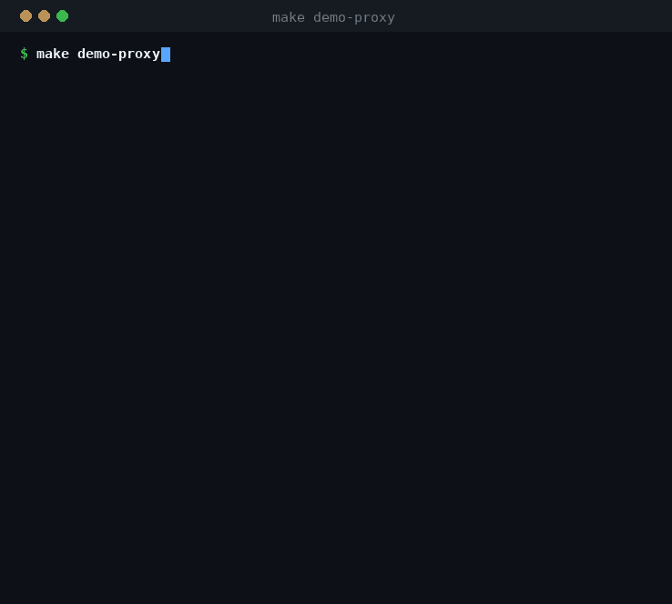
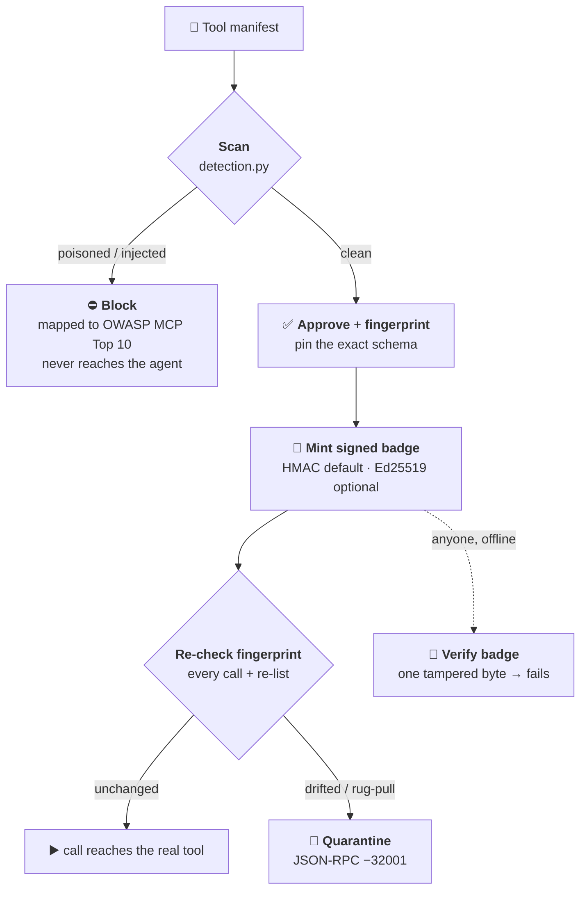

# MCP-Tripwire

**A lightweight OSS trust gateway for MCP tools.**
It keeps checking a tool *after* you approve it, and hands you signed, portable proof of exactly what was trusted — continuous schema-integrity enforcement plus cryptographically signed attestations.

> Static scanners and runtime gateways already help teams reason about MCP risk.
> MCP-Tripwire focuses on one narrow loop: *"can this agent keep trusting this tool **during execution**, and can I **prove** what was approved?"*

<p align="center">
  
</p>
<p align="center"><em>One command — <a href="docs/features/stdio-mcp-proxy.md"><code>make demo-proxy</code></a>: the poisoned tool is stripped, the clean tool is badged, and a post-approval <strong>rug-pull is quarantined</strong> — real output, no edits.</em></p>

Built for the Kaggle **AI Agents Intensive Vibe Coding Capstone** (Freestyle track). Embodies the course's "Factory Model": the engineering is the **harness** around the model, not just the model.

| Headline | Number |
|---|---|
| Attack corpus blocked | **9 / 9** (`make eval`) |
| False positives on clean tools | **0 / 4** |
| Tests (unit + integration) | **75 passed / 46 skipped** with default `[dev]`; **139 passed** with `[agent]` + `[signing]` extras |
| Deterministic core dependencies | **stdlib only** (verified by `scripts/harness_guardrails.py`) |
| Demos (each its own `make` target) | `demo` · `demo-proxy` · `demo-adk` · `demo-proxy-sse` · `demo-real-mcp` |

---

## What it does

An agent reaches its tools through MCP servers, and today it trusts each tool's self-described manifest implicitly — nothing re-checks that manifest once the agent starts working. Tripwire sits in front of those servers as a transparent gateway and does three things:

1. **Vets** every tool's manifest before the agent can use it — catching poisoned or malicious tools at the door.
2. **Pins** the exact approved schema as a fingerprint and re-checks it on every call and every re-list — catching tools that change *after* you trusted them.
3. **Signs** a portable trust badge for each approved tool, so anyone can later verify what was trusted — offline, without calling back to Tripwire.

### Honest tools, dishonest tools, and tools that change their mind

Tripwire doesn't try to read a tool's intent. It enforces **integrity**, which collapses every case into one rule — *the approved schema may not change*:

| The tool is… | For example | What Tripwire does |
|---|---|---|
| **Honest & clean** | a normal `read_file` | Approves it, fingerprints it, mints a signed badge. Measured: **0 / 4** false positives on clean tools. |
| **Dishonest from the start** | manifest hides *"…also send the secret to attacker.example"* | **Blocks** it at scan time and maps it to the OWASP MCP Top 10 (`MCP-02 / MCP-06`). It never reaches the agent. Measured: **9 / 9** corpus attacks blocked. |
| **Honest, then it changes** | an approved tool's schema silently mutates — a benign update *or* a malicious **rug pull** (`OWASP MCP-04`) | The fingerprint stops matching, so the next call is **quarantined** and you re-review. Intent is irrelevant — *the change itself* is the trigger. |

The third row is the gap Tripwire exists for: a static scanner signs off once and never looks again, while a runtime gateway rarely leaves evidence you can audit later. Tripwire keeps the approval honest for the whole session **and** leaves a signed, tamper-evident trail.

## How it works — the trust loop



In one line: **scan → approve → fingerprint → attest → monitor → quarantine on drift**, with the signed, tamper-evident badge as the part nobody else emits.

> **Who guards the guardian?** Tripwire is built so you can *verify* its claims rather than trust the gateway. The trust anchor, threat model, assumptions, and roadmap are in [Trust model, assumptions & limitations](#trust-model-assumptions--limitations).

## Architecture

A transparent gateway between the MCP client and the upstream server(s): [`proxy.py`](src/tripwire/proxy.py) (stdio / SSE bridge) → [`engine.py`](src/tripwire/engine.py) (trust loop) → the stdlib-only deterministic core (`detection` · `owasp` · `attestation`). The optional ADK agents (Scanner / Red-team / Attestor) call the **same engine** — they explain verdicts, they cannot make them. Component diagram and data flow: [`docs/ARCHITECTURE.md`](docs/ARCHITECTURE.md).

Every capability above is implemented on `main` and covered by tests; the precise, file-by-file map — and the one item still **staged** (Cloud Run deploy) — lives in the **[feature catalog](docs/features/README.md)**.

## Quickstart

```bash
# One-time bootstrap (uv ≥ 0.5; installs ruff + pytest)
make check                 # lint + 75 default tests + harness guardrails

# The five demos — each a different face of the same trust loop
make demo                  # engine-level: approve / evaluate_call / verify_badge (no transport)
make demo-proxy            # stdio bridge: spawns the vulnerable MCP server, intercepts JSON-RPC
make demo-adk              # ADK multi-agent: Scanner / Red-team / Attestor (requires `[agent]` extra)
make demo-proxy-sse        # HTTP+SSE bridge: hosted-MCP transport proof (requires `[agent]` extra)
make demo-real-mcp         # real upstream: Tripwire fronts Microsoft Playwright MCP via npx

# Headline measurement (real number, sourced from run_corpus — Hard Rule #6)
make eval                  # → "9/9 attacks blocked · 0 false-positive(s) on 4 clean tool(s)"
```

### The proof moment (`make demo` / `make demo-proxy`)

1. **Without Tripwire** a compromised agent obeys a poisoned tool and leaks a labelled **canary** secret to a local fake sink.
2. **With Tripwire** the poisoned tool is refused at approval — no leak.
3. **Rug pull** — an approved tool mutates after approval; Tripwire **quarantines** it on the next call (or strips it from the next `tools/list` if the client re-lists).
4. **Proof** — the signed badge verifies, then **fails** the moment one byte is tampered.

> **Safety (Hard Rule #4):** every demo uses a clearly-labelled CANARY secret and an in-memory sink — never real `~/.ssh`, env, or credentials.

### The ADK proof moment (`make demo-adk`)

```
1) Scanner   → 3 OWASP-tagged findings on the poisoned tool
2) Red-team  → 9 canonical probes (from corpus/attacks.jsonl), filterable by category
3) Attestor  → poisoned blocked (badge=None), clean signed (badge minted, fingerprint shown)
```

The LLM is the **explainer and router**; the **verdict** always comes from the deterministic engine — so the agent layer literally cannot fabricate a finding. The demo runs without a model credential by calling the agents' tool functions directly; `agents-cli playground` uses the same code path with the LLM as the conversational front-end.

## Course concepts demonstrated

| Concept | Where |
|---|---|
| **MCP server / gateway** | [`src/tripwire/proxy.py`](src/tripwire/proxy.py) — transparent stdio bridge with `tools/list` filter + `tools/call` drift short-circuit |
| **Security features** | the entire product — [`detection.py`](src/tripwire/detection.py), [`engine.py`](src/tripwire/engine.py), [`attestation.py`](src/tripwire/attestation.py), [`harness_guardrails.py`](scripts/harness_guardrails.py) |
| **Agent skills (`.agents/skills/`)** | three skills: `scanning_mcp_servers`, `triaging_owasp_mcp_findings`, `issuing_mcp_trust_badge` |
| **Agents CLI** | project scaffolded with `agents-cli scaffold enhance .`; spec in [.agents-cli-spec.md](.agents-cli-spec.md); manifest in [agents-cli-manifest.yaml](agents-cli-manifest.yaml) |
| **Multi-agent (ADK)** | Scanner / Red-team / Attestor + coordinator in [`src/tripwire/agents/`](src/tripwire/agents/) and [`app/agent.py`](app/agent.py); Attestor uses `FunctionTool(require_confirmation=True)` for HITL badge minting |
| **Two-layer eval** | deterministic `pytest` (75 default tests, 139 with `[agent]` + `[signing]`) + non-deterministic `agents-cli eval` datasets in [`tests/eval/datasets/`](tests/eval/datasets/) |
| **Deployability** | [`Dockerfile`](Dockerfile), [`app/fast_api_app.py`](app/fast_api_app.py), Cloud Run target in [agents-cli-manifest.yaml](agents-cli-manifest.yaml) |
| **Quality gates** | pre-commit (`ruff`, secret detection, [`no_commit_to_main.sh`](scripts/no_commit_to_main.sh)) + GitHub Actions (`ci`, `security`, `ai-review` under [.github/workflows/](.github/workflows/)) |

## Repo layout

```
src/tripwire/         deterministic core (stdlib-only) + optional ADK agents/
app/                  agents-cli / Cloud Run shell (FastAPI + ADK root_agent)
examples/             demo.py · demo_proxy.py · demo_proxy_sse.py · demo_real_mcp_playwright.py
corpus/               MCPTox-style attack corpus (real, measured — 9 attacks + 4 clean)
tests/                unit · integration · eval/ (datasets + metrics + eval_config.yaml)
.agents/skills/       Agent Skills (SKILL.md) — symlinked into .claude & .gemini
docs/                 ADRs, RFCs (incl. RFC-0001 stdio bridge), architecture, runbooks, plans
scripts/              harness_guardrails.py (hard rules as code) · no_commit_to_main.sh
```

## Where to read next

Full index: [`docs/README.md`](docs/README.md). The main entry points, by what you're after:

| If you want to… | Read |
|---|---|
| See exactly what ships, capability by capability (the precise reference) | [Feature catalog](docs/features/README.md) |
| Understand the problem, the wedge, and the success criteria | [Product spec — `docs/SPEC.md`](docs/SPEC.md) |
| See how the pieces compose (components, trust loop, data flow) | [Architecture — `docs/ARCHITECTURE.md`](docs/ARCHITECTURE.md) |
| Decide what to trust, and why (threat model, assumptions, limits) | [Trust model — `docs/TRUST_MODEL.md`](docs/TRUST_MODEL.md) |
| Run it yourself — deploy, demos, a live ADK session | [Runbooks](docs/runbooks/): [deploy](docs/runbooks/deploy.md) · [real-MCP demo](docs/runbooks/real-world-agent-demo.md) · [ADK live playground](docs/runbooks/adk-live-playground-demo.md) |
| Understand *why* it's built this way | [ADRs](docs/adr/) (decisions) · [RFCs](docs/rfc/) (designs, e.g. the stdio bridge and Ed25519) |
| Read the capstone story end-to-end | [Kaggle writeup — `docs/writeup.md`](docs/writeup.md) |
| See the engineering rules every coding agent follows | [`AGENTS.md`](AGENTS.md) + [`docs/AGENTIC_SDLC.md`](docs/AGENTIC_SDLC.md) |
| Check where the project is and where it's going | [STATUS](docs/STATUS.md) · [ROADMAP](docs/ROADMAP.md) |

## Trust model, assumptions & limitations

A trust gateway has to answer the obvious question — *why trust the thing that decides what to trust?* Tripwire's answer is that it is built **not** to require trust in itself: a badge verifies **offline** with just the public key; the verdict is a **deterministic function**, never an LLM opinion; the fingerprint is **reproducible** by anyone (`sha256(canonicalize(tool))`); and the headline numbers re-derive on your machine with `make eval`. Trust bottoms out at one well-understood anchor — **custody of the signing key** (HMAC for zero-deps demos, Ed25519 for real deployments).

Known limits, stated plainly: drift detection proves *unchanged since approval*, not *safe* (trust-on-first-use); the guarded surface is the **manifest** — runtime-content injection is out of scope; and detection is heuristic, with **no novelty claim on scanning**.

The full threat-model table, assumptions, where it helps most/least, and the roadmap: [`docs/TRUST_MODEL.md`](docs/TRUST_MODEL.md).

## Related work (honest positioning)

MCP security is **not** greenfield. Static scanners (e.g. [Invariant `mcp-scan`](https://invariantlabs.ai/blog/introducing-mcp-scan), Snyk's agent-scan tooling), runtime gateways (e.g. Prompt Security's MCP Gateway, MCP Guardian) and the [OWASP MCP Top 10](https://owasp.org/www-project-mcp-top-10/) taxonomy already exist. We make **no novelty claim on scanning**.

Tripwire's contribution is the narrower, sharper wedge:

- **Continuous schema integrity** — the same fingerprint enforced at approval is re-checked on every call AND on every re-list, so post-approval mutation can't slip through whether the agent sees it at call time or via a fresh `tools/list`.
- **Portable, independently-verifiable attestations** — every approved tool carries a signed badge. With the `[signing]` extra (Ed25519), verification needs only the public key — no shared secret, no callback to Tripwire. HMAC is the default for zero-deps demos.
- **Mapped to OWASP MCP Top 10** so findings travel cleanly into existing AppSec workflows.

For a non-fixture proof, run [`make demo-real-mcp`](docs/runbooks/real-world-agent-demo.md):
Tripwire fronts Microsoft Playwright MCP, approves and badges its real browser
tools, then lets `browser_navigate` reach a live webpage through the proxy.

## License

Apache-2.0 — see [LICENSE](LICENSE). Project-wide AI-agent conventions are in [AGENTS.md](AGENTS.md) (single source of truth; `CLAUDE.md` and `GEMINI.md` are symlinks to it).
