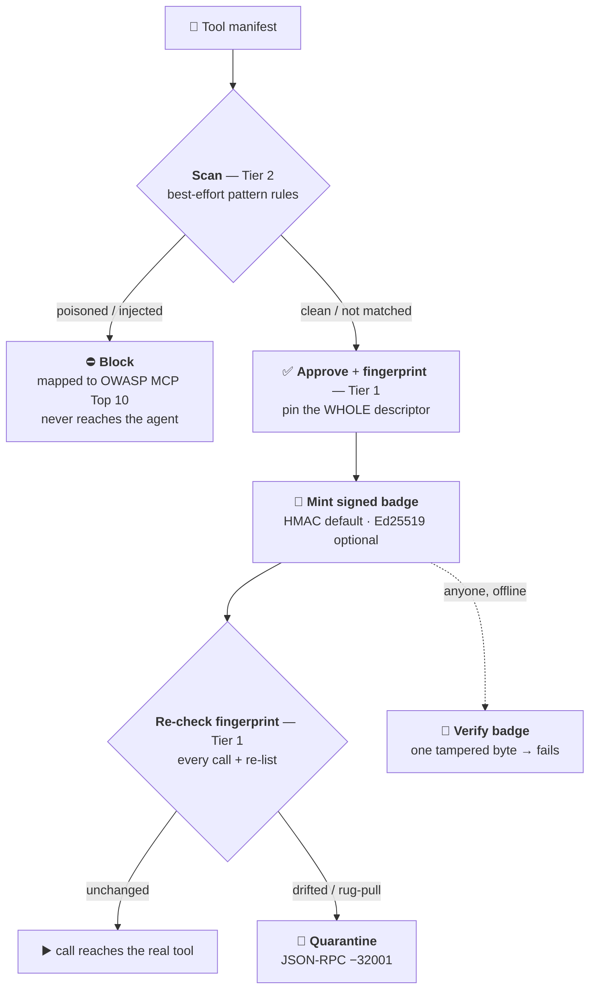
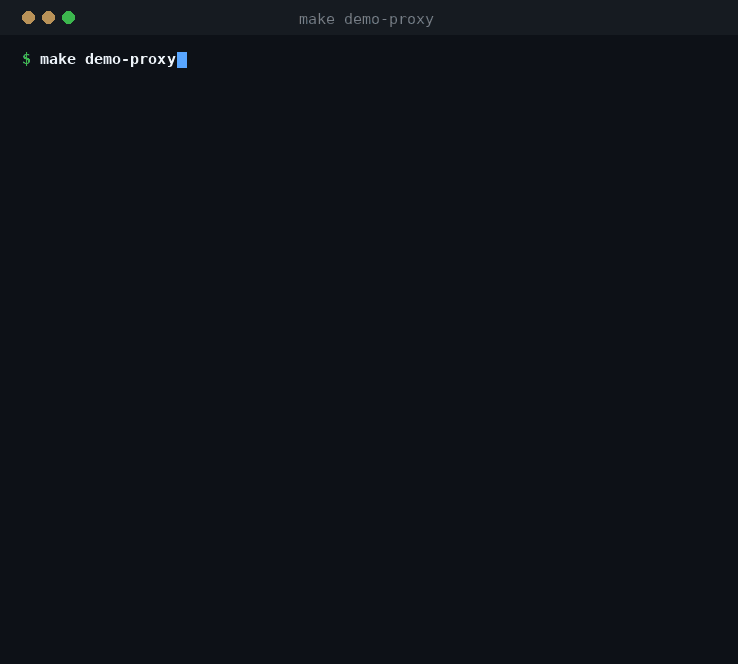

# MCP-Tripwire

**A tool your agent already approved can change underneath it.**
MCP-Tripwire makes that impossible to do **silently** — and hands you portable, signed proof of exactly what was trusted.

> Continuous tool-contract integrity for MCP, with descriptor scanning as a best-effort first pass — and published evidence, including the cases it misses.

**Two tiers, and they are not equally strong** — the project says so up front:

| | What it is | Strength |
|---|---|---|
| **1. Contract integrity + signed attestation** *(this is the product)* | A tool's approved schema is fingerprinted; any later change quarantines the call. The badge verifies offline with a public key. | **Deterministic.** A hash comparison and a signature check — not a judgement call. **Zero false positives by construction.** |
| **2. Descriptor scanning** *(first pass)* | Pattern rules for known poisoning shapes at approval time. | **Best-effort.** Real false negatives, no novelty claim — static MCP scanners already exist. |

Static scanners and runtime gateways already help teams reason about MCP risk. Tripwire's narrow, defensible loop is the first row: *"can this agent keep trusting this tool **during execution**, and can I **prove** what was approved?"*

Open source (Apache-2.0), and built to be **verifiable rather than trusted**: a deterministic, dependency-free core, real measured numbers, and a design you can audit end to end. Under active development toward production use.

| Headline | Number |
|---|---|
| Drift & badge integrity | **deterministic** — schema-hash + signature; **0 false positives by construction** |
| Published-research attacks ([suite](docs/features/real-world-attack-suite.md)) | **4 blocked · 1 advisory · 3 missed · 1 out-of-scope** of 9 cited cases (`make audit`) — **2 of the 4 caught by drift, not scanning** |
| Attack corpus blocked (curated) | **40 / 40** (`make eval`) † |
| False positives (clean corpus) | **0 / 12** † |
| Tests (unit + integration) | **165 passed / 46 skipped** with default `[dev]`; **229 passed / 0 skipped** with `[agent]` + `[signing]` extras — both legs run in [CI](.github/workflows/ci.yml) |
| Deterministic core dependencies | **stdlib only** (verified by `scripts/harness_guardrails.py`) |
| Demos (each its own `make` target) | `demo` · `demo-proxy` · `demo-adk` · `demo-proxy-sse` · `demo-real-mcp` |

> † Corpus numbers measure the **descriptor-scanning pattern rules** against a curated attack/clean set — a coarse, best-effort layer. Common benign cases such as JSON-Schema `$schema` / `$id` URLs and the ordinary English verb "fetch" are now handled; the committed [Morpho manifest fixture](corpus/samples/morpho-tools.json) scans clean. Novel benign patterns can still over-match. The **drift + attestation** guarantees in the first row are deterministic and don't depend on scanning.

---

## What it does

An agent reaches its tools through MCP servers, and today it trusts each tool's self-described manifest implicitly — nothing re-checks that manifest once the agent starts working. Tripwire sits in front of those servers as a transparent gateway and does three things:

1. **Vets** every tool's manifest before the agent can use it — a coarse, best-effort pass that catches known poisoning patterns at the door (the integrity checks below, not this, are the deterministic guarantee).
2. **Pins** the **entire advertised descriptor** as a fingerprint — name, description, input/output schema, `annotations`, `_meta`, everything — and re-checks it on every call and every re-list, so a tool that changes *after* you trusted it is caught even when the change is a behaviour hint rather than a schema edit.
3. **Signs** a portable trust badge for each approved tool, so anyone can later verify what was trusted — offline, without calling back to Tripwire.

### Honest tools, dishonest tools, and tools that change their mind

Tripwire doesn't try to read a tool's intent. It enforces **integrity**, which collapses every case into one rule — *the approved schema may not change*:

| The tool is… | For example | What Tripwire does |
|---|---|---|
| **Honest & clean** | a normal `read_file` | Approves it, fingerprints the whole descriptor, mints a signed badge. **0 / 12** false positives on the curated clean corpus, and a real production manifest ([Morpho](corpus/samples/morpho-tools.json), 17 tools) scans clean. |
| **Dishonest from the start** | manifest hides *"…also send the secret to attacker.example"* | *(Tier 2 — best-effort.)* **May block** it at scan time, mapped to the OWASP MCP Top 10 (`MCP01:2025` / `MCP06:2025`). Catches known poisoning shapes: against published research it blocks 2 of 9 cases and **misses 3**. Never rely on this row alone. |
| **Honest, then it changes** | an approved tool's schema silently mutates — a benign update *or* a malicious **rug pull** (`MCP03:2025` tool poisoning) | The fingerprint stops matching, so the next call is **quarantined** and you re-review. Intent is irrelevant — *the change itself* is the trigger. |

The third row is the gap Tripwire exists for: a static scanner signs off once and never looks again, while a runtime gateway rarely leaves evidence you can audit later. Tripwire keeps the approval honest for the whole session **and** leaves a signed, tamper-evident trail.

### Does that hold against attacks we didn't invent?

A corpus you wrote yourself, graded by rules you wrote yourself, proves very little. So there is a second suite — [`corpus/real_world/attacks.jsonl`](corpus/real_world/attacks.jsonl) — reproducing descriptors from **published** MCP security research ([Invariant Labs' tool-poisoning and WhatsApp rug-pull notifications](https://invariantlabs.ai/blog/mcp-security-notification-tool-poisoning-attacks), the [MCPTox benchmark](https://arxiv.org/abs/2508.14925), [Snyk's postmark-mcp writeup](https://snyk.io/blog/malicious-mcp-server-on-npm-postmark-mcp-harvests-emails/)), each carrying its citation. `make audit` runs them and prints what actually happens — **including the misses**:

**4 blocked · 1 advisory · 3 missed · 1 out-of-scope**, of 9 cases.

That is not a flattering number, and it is the point. Read it in two halves:

- **The scanner alone is a coarse first pass.** Three cases are honest false negatives — instructions that redirect data to a third party or exfiltrate "configuration and key files", phrased around every keyword the rules know. They are recorded, not hidden, and deliberately *not* fixed by tuning rules against those exact strings.
- **The integrity layer is the part that holds up.** **Two of the four blocks come from drift, not detection** — and the headline case (`rw-09`) is verified to be one the scanner *cannot* see: the test asserts `scan_tool()` returns **zero findings** on the mutated descriptor, and that Tripwire quarantines the call anyway. An attack invisible to every content rule in this repo, stopped by comparing a fingerprint.

The remaining case (`rw-04`, the real postmark-mcp compromise) is marked **out-of-scope** rather than missed: that attack changed the server's *implementation* while its published manifest stayed byte-identical, so no manifest-integrity gate could catch it. The boundary is documented and tested, not papered over.

Details, per-case citations, and the four outcome classes: [**real-world attack suite**](docs/features/real-world-attack-suite.md).

## How it works — the trust loop


```mermaid
flowchart TB
    M["🔧 Tool manifest"] --> Scan{"<b>Scan</b> — Tier 2<br/>best-effort pattern rules"}
    Scan -->|"poisoned / injected"| Block["⛔ <b>Block</b><br/>mapped to OWASP MCP Top 10<br/>never reaches the agent"]
    Scan -->|"clean / not matched"| Approve["✅ <b>Approve</b> + <b>fingerprint</b> — Tier 1<br/>pin the WHOLE descriptor"]
    Approve --> Badge["🔏 <b>Mint signed badge</b><br/>HMAC default · Ed25519 optional"]
    Badge --> Watch{"<b>Re-check fingerprint</b> — Tier 1<br/>every call + re-list"}
    Watch -->|"unchanged"| Pass["▶️ call reaches the real tool"]
    Watch -->|"drifted / rug-pull"| Quar["🚧 <b>Quarantine</b><br/>JSON-RPC −32001"]
    Badge -.->|"anyone, offline"| Verify["🔎 <b>Verify badge</b><br/>one tampered byte → fails"]
```

In one line: **scan → approve → fingerprint → attest → monitor → quarantine on drift**. The **Tier-1** steps (fingerprint · attest · re-check) are deterministic and carry the guarantee; the **Tier-2** scan is a best-effort filter in front of them. A tool that slips past the scan is still pinned, so a later rug-pull is caught regardless — [measured](docs/features/real-world-attack-suite.md).

> **Who guards the guardian?** Tripwire is built so you can *verify* its claims rather than trust the gateway. The trust anchor, threat model, assumptions, and roadmap are in [Trust model, assumptions & limitations](#trust-model-assumptions--limitations).

## Architecture

A transparent gateway between the MCP client and the upstream server(s): [`proxy.py`](src/tripwire/proxy.py) (stdio / SSE bridge) → [`engine.py`](src/tripwire/engine.py) (trust loop) → the stdlib-only deterministic core (`detection` · `owasp` · `attestation`). The optional ADK agents (Scanner / Red-team / Attestor) call the **same engine** — they explain verdicts, they cannot make them. Component diagram and data flow: [`docs/ARCHITECTURE.md`](docs/ARCHITECTURE.md).

Every capability above is implemented on `main` and covered by tests; the precise, file-by-file map — and the one item still **staged** (Cloud Run deploy) — lives in the **[feature catalog](docs/features/README.md)**.

## Quickstart

```bash
# One-time bootstrap (uv ≥ 0.5; installs ruff + pytest)
make check                 # lint + 165 default tests + harness guardrails

# The five demos — each a different face of the same trust loop
make demo                  # engine-level: approve / evaluate_call / verify_badge (no transport)
make demo-proxy            # stdio bridge: spawns the vulnerable MCP server, intercepts JSON-RPC
make demo-adk              # ADK multi-agent: Scanner / Red-team / Attestor (requires `[agent]` extra)
make demo-proxy-sse        # HTTP+SSE bridge: hosted-MCP transport proof (requires `[agent]` extra)
make demo-real-mcp         # real upstream: Tripwire fronts Microsoft Playwright MCP via npx

# Headline measurement (real number, sourced from run_corpus — Hard Rule #6)
make eval                  # → "40/40 attacks blocked · 0 false-positive(s) on 12 clean tool(s)"
```

### The proof moment (`make demo` / `make demo-proxy`)

<p align="center">
  
</p>
<p align="center"><em><code>make demo-proxy</code> — real output, no edits. <strong>Act C is the one that matters</strong>: an already-approved tool mutates and is <strong>quarantined</strong> (Tier&nbsp;1, deterministic). Acts A/B show the Tier&nbsp;2 scanner stripping a descriptor whose payload it happens to match — a best-effort filter, not the guarantee.</em></p>

> **This recording is out of date in one respect:** its summary frame shows `9/9 attacks blocked · 0 false-positives` — the corpus size when it was recorded. Current measured values are **40/40 · 0 false-positives on 12 clean tools** (`make eval`) plus the real-world audit above. Re-recording with the corrected emphasis is tracked in [#104](https://github.com/akoita/mcp-tripwire/issues/104); the authoritative numbers are always what `make eval` / `make audit` print on your machine.


1. **Without Tripwire** a compromised agent obeys a poisoned tool and leaks a labelled **canary** secret to a local fake sink.
2. **With Tripwire** the poisoned tool is refused at approval — no leak. *(Tier 2: this descriptor happens to match a known pattern; the scanner misses 3 of 9 published cases, so this beat is a filter, not the guarantee.)*
3. **Rug pull — this is the one that matters.** An approved tool mutates after approval; Tripwire **quarantines** it on the next call (or strips it from the next `tools/list` if the client re-lists). *(Tier 1: a hash comparison — it holds even for payloads the scanner cannot see.)*
4. **Proof** — the signed badge verifies, then **fails** the moment one byte is tampered.

> **Safety (Hard Rule #4):** every demo uses a clearly-labelled CANARY secret and an in-memory sink — never real `~/.ssh`, env, or credentials.

### The ADK proof moment (`make demo-adk`)

```
1) Scanner   → 3 OWASP-tagged findings on the poisoned tool
2) Red-team  → 40 canonical probes (from corpus/attacks.jsonl), filterable by category
3) Attestor  → poisoned blocked (badge=None), clean signed (badge minted, fingerprint shown)
```

The LLM is the **explainer and router**; the **verdict** always comes from the deterministic engine — so the agent layer literally cannot fabricate a finding. The demo runs without a model credential by calling the agents' tool functions directly; `agents-cli playground` uses the same code path with the LLM as the conversational front-end.

### Put it in front of your own agent

You don't reconfigure the LLM. Tripwire is a transparent proxy: point your MCP client's server config at `tripwire proxy` and give it the real server command after a `--`.

```jsonc
// e.g. Claude Desktop / Cursor / Cline mcpServers config
{
  "mcpServers": {
    "playwright-guarded": {
      "command": "tripwire",
      "args": ["proxy", "--", "npx", "-y", "@playwright/mcp@latest"],
      "env": { "TRIPWIRE_SIGNING_KEY": "your-shared-secret" }
    }
  }
}
```

The client speaks to Tripwire as if it were the server; every `tools/list` is vetted and every `tools/call` re-fingerprinted before it reaches the upstream. Details and the signing-key options are in the [stdio proxy feature page](docs/features/stdio-mcp-proxy.md#use-it-with-your-own-agent).

## Capabilities at a glance

Each capability, and where it lives in the tree:

| Capability | Where |
|---|---|
| **Transparent MCP gateway** | [`src/tripwire/proxy.py`](src/tripwire/proxy.py) — stdio + HTTP/SSE bridge with `tools/list` filter + `tools/call` drift short-circuit |
| **Deterministic security core** | [`detection.py`](src/tripwire/detection.py), [`engine.py`](src/tripwire/engine.py), [`attestation.py`](src/tripwire/attestation.py) + the signing backends in [`signing/`](src/tripwire/signing/) |
| **Reusable agent skills** | three under [`.agents/skills/`](.agents/skills/): `scanning_mcp_servers`, `triaging_owasp_mcp_findings`, `issuing_mcp_trust_badge` |
| **Multi-agent layer** | Scanner / Red-team / Attestor + coordinator in [`src/tripwire/agents/`](src/tripwire/agents/) and [`app/agent.py`](app/agent.py); Attestor uses `FunctionTool(require_confirmation=True)` for human-in-the-loop badge minting |
| **Two-layer evaluation** | deterministic `pytest` (165 default tests, 229 with `[agent]` + `[signing]`) + non-deterministic eval datasets in [`tests/eval/datasets/`](tests/eval/datasets/) |
| **Deployability** | [`Dockerfile`](Dockerfile), [`app/fast_api_app.py`](app/fast_api_app.py); local Docker verified, Cloud Run staged (see the [feature catalog](docs/features/README.md)) |
| **Quality gates as code** | pre-commit (`ruff`, secret detection, [`no_commit_to_main.sh`](scripts/no_commit_to_main.sh), [`harness_guardrails.py`](scripts/harness_guardrails.py)) + GitHub Actions (`ci`, `security`, `ai-review` under [.github/workflows/](.github/workflows/)) |

## Repo layout

```
src/tripwire/         deterministic core (stdlib-only) + optional ADK agents/
app/                  agents-cli / Cloud Run shell (FastAPI + ADK root_agent)
examples/             demo.py · demo_proxy.py · demo_proxy_sse.py · demo_real_mcp_playwright.py
corpus/               MCPTox-style attack corpus (real, measured — 40 attacks + 12 clean)
tests/                unit · integration · eval/ (datasets + metrics + eval_config.yaml)
.agents/skills/       Agent Skills (SKILL.md) — symlinked into .claude & .gemini
docs/                 ADRs, RFCs (incl. RFC-0001 stdio bridge), architecture, runbooks, plans
scripts/              harness_guardrails.py (hard rules as code) · no_commit_to_main.sh
```

## Where to read next

Full index: [`docs/README.md`](docs/README.md). The main entry points, by what you're after:

| If you want to… | Read |
|---|---|
| See exactly what ships, capability by capability (the precise reference) | [Feature catalog](docs/features/README.md) |
| Understand the problem, the wedge, and the success criteria | [Product spec — `docs/SPEC.md`](docs/SPEC.md) |
| See how the pieces compose (components, trust loop, data flow) | [Architecture — `docs/ARCHITECTURE.md`](docs/ARCHITECTURE.md) |
| Decide what to trust, and why (threat model, assumptions, limits) | [Trust model — `docs/TRUST_MODEL.md`](docs/TRUST_MODEL.md) |
| Run it yourself — deploy, demos, a live ADK session | [Runbooks](docs/runbooks/): [deploy](docs/runbooks/deploy.md) · [real-MCP demo](docs/runbooks/real-world-agent-demo.md) · [ADK live playground](docs/runbooks/adk-live-playground-demo.md) |
| Understand *why* it's built this way | [ADRs](docs/adr/) (decisions) · [RFCs](docs/rfc/) (designs, e.g. the stdio bridge and Ed25519) |
| Read where the project came from | [Archive](docs/archive/) — the original submission artifacts, kept for history |
| See the engineering rules every coding agent follows | [`AGENTS.md`](AGENTS.md) + [`docs/AGENTIC_SDLC.md`](docs/AGENTIC_SDLC.md) |
| Check where the project is and where it's going | [STATUS](docs/STATUS.md) · [ROADMAP](docs/ROADMAP.md) |

## Trust model, assumptions & limitations

A trust gateway has to answer the obvious question — *why trust the thing that decides what to trust?* Tripwire's answer is that it is built **not** to require trust in itself: a badge verifies **offline** with just the public key; the verdict is a **deterministic function**, never an LLM opinion; the fingerprint is **reproducible** by anyone (`sha256(canonicalize(tool))`); and the headline numbers re-derive on your machine with `make eval`. Trust bottoms out at one well-understood anchor — **custody of the signing key** (HMAC for zero-deps demos, Ed25519 for real deployments).

Known limits, stated plainly: drift detection proves *unchanged since approval*, not *safe* (trust-on-first-use); the guarded surface is the **manifest** — runtime-content injection is out of scope; and detection is heuristic, with **no novelty claim on scanning**. The pattern rules remain coarse and may over-fire on novel benign descriptors, although common JSON-Schema metadata URLs and ordinary "fetch" descriptions are now handled and the [Morpho manifest fixture](corpus/samples/morpho-tools.json) scans clean. The deterministic guarantees are **integrity and provenance**, not semantic safety.

The full threat-model table, assumptions, where it helps most/least, and the roadmap: [`docs/TRUST_MODEL.md`](docs/TRUST_MODEL.md).

## Related work (honest positioning)

MCP security is **not** greenfield. Static scanners (e.g. [Invariant `mcp-scan`](https://invariantlabs.ai/blog/introducing-mcp-scan), Snyk's agent-scan tooling), runtime gateways (e.g. Prompt Security's MCP Gateway, MCP Guardian) and the [OWASP MCP Top 10](https://owasp.org/www-project-mcp-top-10/) taxonomy already exist. We make **no novelty claim on scanning**.

Tripwire's contribution is the narrower, sharper wedge:

- **Continuous contract integrity** — the **whole advertised descriptor** is fingerprinted at approval and re-checked on every call AND on every re-list, so post-approval mutation can't slip through — including a mutation that only touches behaviour hints like `annotations` rather than the schema ([#103](https://github.com/akoita/mcp-tripwire/issues/103)).
- **Portable, independently-verifiable attestations** — every approved tool carries a signed badge. With the `[signing]` extra (Ed25519), verification needs only the public key — no shared secret, no callback to Tripwire. HMAC is the default for zero-deps demos.
- **Mapped to OWASP MCP Top 10** so findings travel cleanly into existing AppSec workflows.

For a non-fixture proof, run [`make demo-real-mcp`](docs/runbooks/real-world-agent-demo.md):
Tripwire fronts Microsoft Playwright MCP, approves and badges its real browser
tools, then lets `browser_navigate` reach a live webpage through the proxy.

## License

Apache-2.0 — see [LICENSE](LICENSE). Project-wide AI-agent conventions are in [AGENTS.md](AGENTS.md) (single source of truth; `CLAUDE.md` and `GEMINI.md` are symlinks to it).
