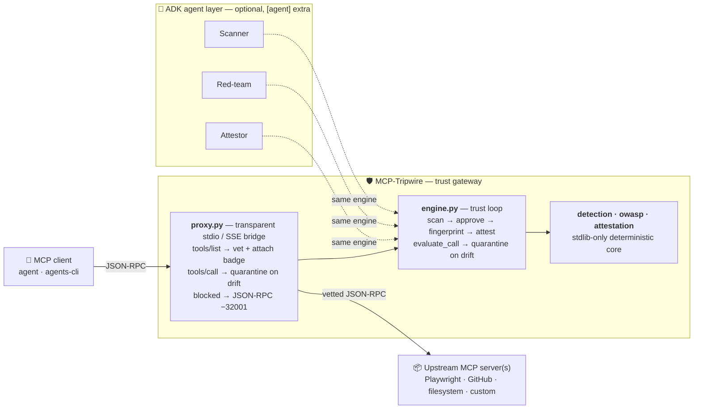

# Architecture

## Component diagram



## Components
| Module | Responsibility |
|---|---|
| `detection.py` | Schema fingerprinting + deterministic poisoning/injection rules (stdlib-only) |
| `engine.py` | The trust loop: approve / block / quarantine / require-approval + registry |
| `attestation.py` | Signed, tamper-evident trust badges (HMAC → Ed25519 in P1) — **the wedge** |
| `owasp.py` | OWASP MCP Top-10 taxonomy mapping |
| `corpus.py` | Attack-corpus runner → real `N/M attacks blocked` |
| `cli.py` | `tripwire scan / verify / ci` |
| `proxy.py` | Transparent stdio MCP gateway (guard logic tested; bridge is E2) |
| `agents/` | Optional ADK layer: Scanner · Red-team · Attestor (P1) |
| `app/` | Cloud Run shell (FastAPI + telemetry) |

## The trust loop (data flow)
```
 tool descriptor
       │
       ▼
 ┌───────────┐   findings    ┌─────────────┐
 │ detection │──────────────▶│   engine    │
 │  (scan +  │  fingerprint  │  approve?   │
 │  finger-  │──────────────▶│  block?     │
 │  print)   │               │  quarantine?│
 └───────────┘               └──────┬──────┘
        ▲ re-check at call time      │ if approved
        │ (drift = rug pull)         ▼
        │                     ┌─────────────┐   verify (anyone, offline)
        └─────────────────────│ attestation │──────────────▶ valid / TAMPERED
                              └─────────────┘
```

## Trust boundaries
- **Client ↔ Tripwire** — only vetted tools (with badges) are ever surfaced to the client.
- **Tripwire ↔ upstream MCP server** — every `tools/list` vetted; every `tools/call` re-checked for drift.
- **Badge ↔ any verifier** — verification is independent and offline; tamper is detectable without trusting Tripwire.

## Transports
JSON-RPC 2.0 over **stdio** (local/prototype) and **SSE/HTTP** (remote), MCP spec `2025-11-25`.

## Deployment
Long-lived gateway → **Cloud Run** (`Dockerfile`, `app/fast_api_app.py`, `agents-cli-manifest.yaml`).
Observability via OpenTelemetry → Cloud Trace; raw payloads never logged.
