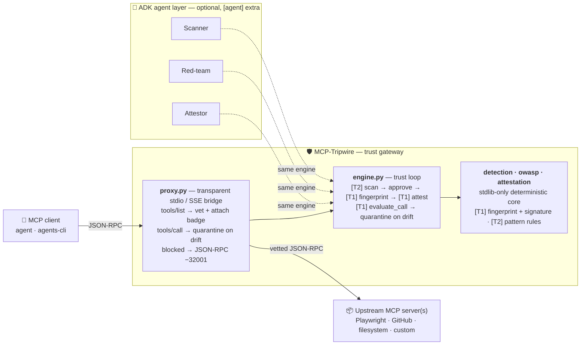

# Architecture

> **Read the strength legend before the boxes.** Two code paths in this diagram
> carry very different promises. **Tier 1** — fingerprint drift and signed
> attestation — is a hash comparison plus a signature check: a deterministic
> guarantee, zero false positives by construction, verifiable offline by anyone.
> **Tier 2** — the descriptor scanner's pattern rules — is a coarse best-effort
> first pass with real false negatives. The architecture below deliberately
> keeps them separable so the guarantee never inherits the heuristic's
> uncertainty. See [TRUST_MODEL.md §1](TRUST_MODEL.md#1-two-tiers-of-strength--read-this-first).

## Component diagram

Legend: **[T1]** = deterministic guarantee · **[T2]** = best-effort heuristic.


```mermaid
flowchart LR
    Client["🤖 MCP client<br/>agent · agents-cli"]
    Server["📦 Upstream MCP server(s)<br/>Playwright · GitHub · filesystem · custom"]

    subgraph Tripwire["🛡 MCP-Tripwire — trust gateway"]
        direction TB
        Proxy["<b>proxy.py</b> — transparent stdio / SSE bridge<br/>tools/list → vet + attach badge<br/>tools/call → quarantine on drift<br/>blocked → JSON-RPC −32001"]
        Engine["<b>engine.py</b> — trust loop<br/>[T2] scan → approve → [T1] fingerprint → [T1] attest<br/>[T1] evaluate_call → quarantine on drift"]
        Core["<b>detection · owasp · attestation</b><br/>stdlib-only deterministic core<br/>[T1] fingerprint + signature · [T2] pattern rules"]
        Proxy --> Engine --> Core
    end

    subgraph ADK["🧠 ADK agent layer — optional, [agent] extra"]
        direction LR
        Scanner["Scanner"]
        Redteam["Red-team"]
        Attestor["Attestor"]
    end

    Client -- "JSON-RPC" --> Proxy
    Proxy -- "vetted JSON-RPC" --> Server

    Scanner -.->|"same engine"| Engine
    Redteam -.->|"same engine"| Engine
    Attestor -.->|"same engine"| Engine
```

## Components

Every module is deterministic in the sense that the same input yields the same
verdict. That is *not* the same as carrying a guarantee — the **Strength**
column says which is which.

| Module | Strength | Responsibility |
|---|---|---|
| `detection.py` — `fingerprint()` | **T1 — guarantee** | Canonical SHA-256 of the tool descriptor. Any byte-level change flips it; intent is never inferred, so no false positives are possible by construction |
| `attestation.py` | **T1 — guarantee** | Signed, tamper-evident trust badges (HMAC → Ed25519 in P1) — **the wedge**. Verifiable offline with only the public key |
| `engine.py` — `evaluate_call()` | **T1 — guarantee** | Approved fingerprint vs. live fingerprint → ALLOW / QUARANTINE. The drift gate |
| `detection.py` — `scan_tool()` rules | **T2 — best-effort** | Poisoning / injection pattern rules (stdlib-only). Real false negatives; a clean scan is *not* a safety claim |
| `engine.py` — `approve()` | T1 + T2 | The trust loop: approve / block / quarantine / require-approval + registry. Combines the T2 scan verdict with the T1 fingerprint + badge |
| `owasp.py` | taxonomy | OWASP MCP Top-10 taxonomy mapping |
| `corpus.py` | measurement | Attack-corpus runner → real `N/M attacks blocked` (a regression gate, not an efficacy claim; the efficacy audit is `scripts/real_world_audit.py`) |
| `cli.py` | surface | `tripwire scan / verify / ci` |
| `proxy.py` | surface | Transparent stdio MCP gateway (guard logic tested; bridge is E2) — the only surface that carries the stateful T1 drift check across a session |
| `agents/` | surface | Optional ADK layer: Scanner · Red-team · Attestor (P1). Explains and routes; never produces the verdict |
| `app/` | surface | Cloud Run shell (FastAPI + telemetry) |

## The trust loop (data flow)
```
 tool descriptor
       │
       ▼
 ┌───────────┐   findings    ┌─────────────┐
 │ detection │─────[T2]─────▶│   engine    │
 │  (scan +  │  fingerprint  │  approve?   │
 │  finger-  │─────[T1]─────▶│  block?     │
 │  print)   │               │  quarantine?│
 └───────────┘               └──────┬──────┘
        ▲ re-check at call time      │ if approved
        │ [T1] drift = rug pull      ▼
        │                     ┌─────────────┐   [T1] verify (anyone, offline)
        └─────────────────────│ attestation │──────────────▶ valid / TAMPERED
                              └─────────────┘

 [T1] deterministic guarantee — hash / signature comparison, no judgement call
 [T2] best-effort pattern rules — a cheap first pass, false negatives are real
```

The `[T2]` edge can fail to fire and the loop still holds its promise: an
approved tool that mutates is quarantined by the `[T1]` re-check regardless of
whether any rule ever matched its content. That is not a theoretical property —
case `rw-09` of the [real-world attack suite](features/real-world-attack-suite.md)
is a descriptor on which `scan_tool()` returns **zero findings** and
`evaluate_call()` still returns `QUARANTINE`.

## Trust boundaries
- **Client ↔ Tripwire** — only vetted tools (with badges) are ever surfaced to the client.
- **Tripwire ↔ upstream MCP server** — every `tools/list` vetted (T2 scan, best-effort); every `tools/call` re-checked for drift (T1, guaranteed for any manifest-surface change).
- **Badge ↔ any verifier** — verification is independent and offline; tamper is detectable without trusting Tripwire (T1).
- **The boundary Tripwire does not draw** — a server that keeps its published manifest byte-identical while changing its implementation is outside every box above (case `rw-04`). See [TRUST_MODEL.md](TRUST_MODEL.md).

## Transports
JSON-RPC 2.0 over **stdio** (local/prototype) and **SSE/HTTP** (remote), MCP spec `2025-11-25`.

## Deployment
Long-lived gateway → **Cloud Run** (`Dockerfile`, `app/fast_api_app.py`, `agents-cli-manifest.yaml`).
Observability via OpenTelemetry → Cloud Trace; raw payloads never logged.
